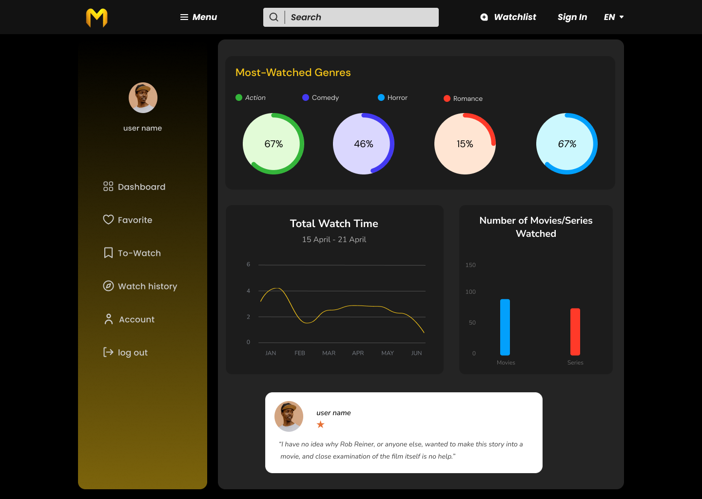
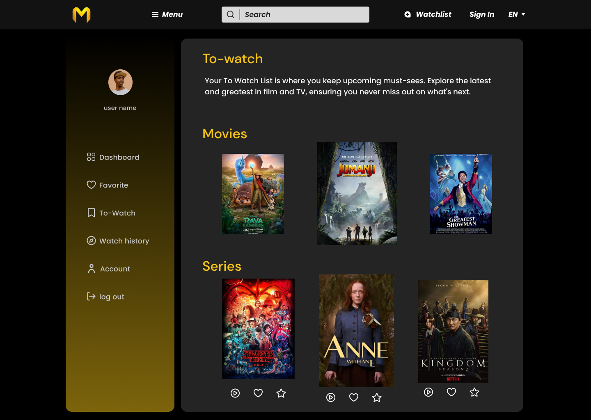
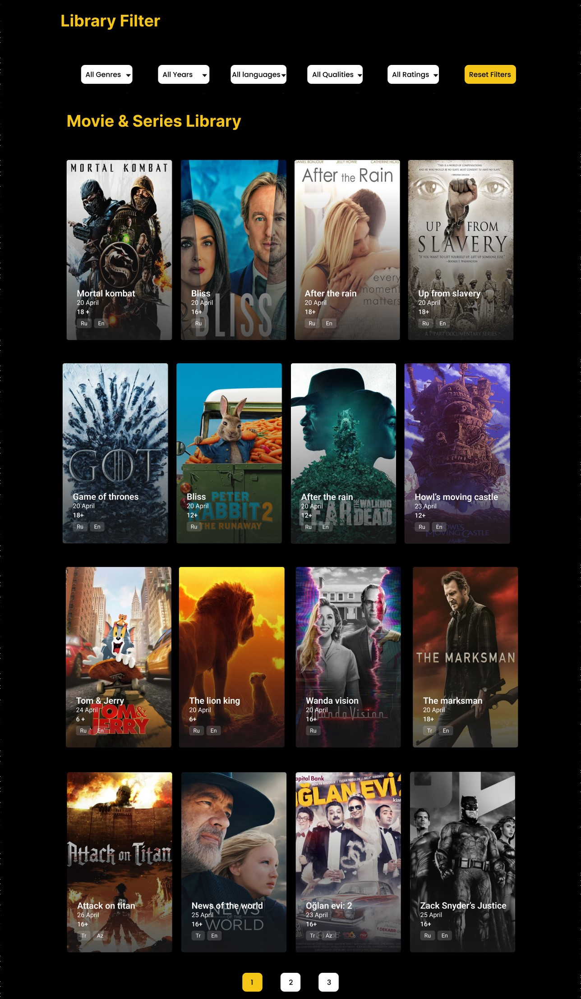

# MovieMingle: Your Ultimate Movie Hub

🎬 **Welcome to MovieMingle!** Dive deep into the world of cinema and embark on a journey of discovery, curation, and reviews. Tailored for movie aficionados like you, MovieMingle offers a rich, interactive platform to navigate through a vast array of films and series, all at your fingertips.

### screenshots:



## 🌟 Key Highlights

- **Cinematic Dashboard**: Visualize your movie journey with graphical insights into your preferences and trending genres.
- **Help & Support**: A dedicated center to assist users with options like resetting passwords, updating emails.
- **Account Creation**: An intuitive sign-up form to help new users create an account effortlessly.
- **Filter like a Pro**: Personalize your exploration with granular filters like genre, release date, ratings, and language.
- **Engage & Explore**: Dive into dynamic movie listings presented in an intuitive card layout that updates on-the-fly as you tweak your filters.
- **Smooth Pagination**: Navigate the cinematic universe effortlessly with our bespoke pagination system.
- **Review & Relay**: Share your cinematic thoughts in our dedicated review section, adorned with a carousel for snappy navigation.
- **Every Device, Every Time**: Experience consistency across devices, thanks to our mobile-first design ethos.

## 🛠 Built With

- **Foundations**: Crafted with HTML5 & CSS3 for a seamless structure and aesthetic appeal.
- **Flexibility with Bootstrap**: Leveraging Bootstrap to deliver responsive layouts and refined components.
- **Interactivity with JavaScript**: Powering dynamic functionalities and real-time interactions.
- **Graphical Insights with Chart.js**: Transforming data into visually compelling stories.
- **Swipe & Slide with Swiper.js**: Ensuring smooth touch sliders and carousels for enriched user engagement.

## 🎛 Dive Deep into Features

### Help & Support Center

A hub for user assistance:

- **Multi-language Support**: Navigate the platform in a language you're comfortable with.
- **Email Updates**: Modify your email details with ease.
- **Movie & TV Show Requests**: Let us know which titles you want added to our collection.
- **Direct Contact Option**: Reach out to our support team directly for any assistance.

### Filter Magic


Discover movies that resonate:

- **Genre**: Navigate through genres and find what thrills you.
- **Year of Release**: Time-travel to movies from specific years.
- **Ratings**: Set your benchmark and discover top-rated films.
- **Language**: Speak cinema in the language you love.

Experience a fluid movie selection that morphs as you filter, ensuring a catered viewing list.

### Account Creation

Embark on your MovieMingle journey:

- **Quick Sign-Up**: Join with just your Name, Email, and Password.
- **Password Criteria**: Ensure it's at least 8 characters for security.

(Note: This is a basic representation. Do remember to ensure the security of user data.)
# Meet our team :


## 🚀 Quick Launch

Ready for your cinematic adventure? Here's how to set the stage:

```bash
# Clone the repository
git clone https://github.com/zakaria-elkoh/Movie-Mingle.git

# Navigate to the project
cd Movie-Mingle

# Open and enjoy!
open index.html

```


